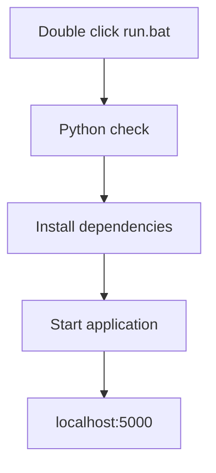

# RDP Dashboard

<div align="center">

```
 ____  ____  ____    ____            _     _                         _ 
|  _ \|  _ \|  _ \  |  _ \  __ _ ___| |__ | |__   ___   __ _ _ __ | |
| |_) | | | | |_) | | | | |/ _` / __| '_ \| '_ \ / _ \ / _` | '_ \| |
|  _ <| |_| |  __/  | |_| | (_| \__ \ | | | |_) | (_) | (_| | | | |_|
|_| \_\____/|_|     |____/ \__,_|___/_| |_|_.__/ \___/ \__,_|_| |_(_)
```

A simple and efficient remote desktop management system

[Features](#features) • [Quick Start](#quick-start) • [Dashboard](#dashboard-interface) • [Documentation](#documentation)

</div>

## ⚡ Quick Start

Just double-click `run.bat` and you're ready to go!



## 🎯 Dashboard Interface

<details>
<summary>Click to see dashboard preview</summary>

```
┌─────────────────── RDP Dashboard ───────────────────┐
│                                                     │
│  ┌─ Logo ─┐                                        │
│  │        │ RDP Dashboard        [Status Machine]   │
│  └────────┘                                        │
│                                                    │
│  [Dashboard]  [PDF Instructions]                    │
│  ┌────────────────────────────────────────────┐    │
│  │ 🔍 Search systems...                       │    │
│  │                                            │    │
│  │ ▼ Hypervisor 1                            │    │
│  │   │                                        │    │
│  │   ├─► VM 1 (192.168.1.101) ● Online       │    │
│  │   └─► VM 2 (192.168.1.102) ○ Offline      │    │
│  │                                            │    │
│  │ ▼ Hypervisor 2                            │    │
│  │   │                                        │    │
│  │   └─► VM 3 (192.168.1.103) ● Online       │    │
│  │                                            │    │
│  └────────────────────────────────────────────┘    │
│                                                    │
│  ℹ️ Right-click any system for actions:            │
│     Ping, RDP, WOL, or Shutdown                    │
└────────────────────────────────────────────────────┘
```
</details>

## 🚀 Features

<table>
<tr>
<td width="25%">

### 💻 Remote Desktop
- Quick RDP connections
- Easy access to systems
- Simple interface

</td>
<td width="25%">

### 📡 Real-time Monitor
- Live status updates
- System health checks
- Instant notifications

</td>
<td width="25%">

### 🔌 Wake-on-LAN
- Remote power on
- System management
- Easy activation

</td>
<td width="25%">

### 📄 PDF Viewer
- Built-in documentation
- Easy navigation
- Quick access

</td>
</tr>
</table>

## 📂 File Structure

```
root/
 ├── run.bat       <- 👉 This is all you need to run!
 ├── app.py        
 ├── rdp.py       
 ├── pdf.py       
 └── requirements.txt
```

## 📋 System Requirements

- Windows OS
- Python 3.x
- Network access to target systems

## 🛠️ Available Actions

Right-click menu options for each system:

- **🔄 Ping** - Check system status
- **💻 RDP** - Connect via Remote Desktop
- **⚡ WOL** - Wake system remotely
- **🔌 Shutdown** - Safely power off system

## 📝 Notes

- Default port: `5000`
- Auto-refresh: Every 30 seconds
- Supports Wake-on-LAN
- Remote shutdown capability

## ❓ Troubleshooting

<details>
<summary>Common Issues</summary>

1. **Python not found**
   - Make sure Python 3.x is installed
   - Verify it's added to PATH

2. **Connection Failed**
   - Check network connectivity
   - Verify system IP addresses
   - Ensure RDP is enabled on target

3. **WOL Not Working**
   - Verify MAC address
   - Check network configuration
   - Enable WOL in BIOS

4. **RDP Connection Issues**
   - Verify target system is online
   - Check RDP service is running
   - Confirm firewall settings
</details>

## 🔧 Getting Help

Check the console output when running `run.bat` for detailed error messages and logs.

---

<div align="center">


</div>
